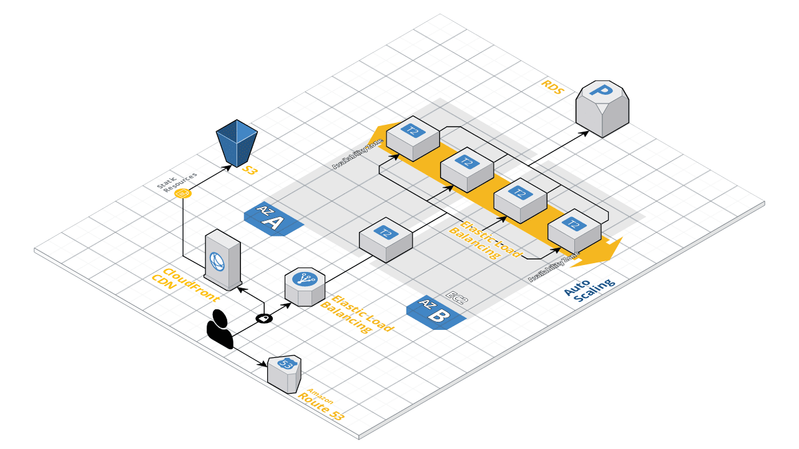

# Nearlog

Nearlog is an image archive platform for travelers. User can take picture of their favorite spot with location while traveling. Currently, this service only supports Korean language.

- Service Links : 
- Client side Native project repository : https://github.com/bgpark82/nearlog-native

## Project Stack
- Java 8
- SpringBoot 2.3.1
- Spring Data JPA
- MariaDB 10.4
- AWS
    - ES2
    - RDS
    - S3
    - CloudFront
    - IAM
    
## Project Architecture
This service can handle large scale traffic by the auto scaling service from AWS. It has one proxy server to distribute the traffic to each scaled up instance
  


(This image is created with [Cloudcraft](https://app.cloudcraft.co/view/517bc377-ece9-447d-909b-90901065f581?key=L7T4bSXr6cMBvRMaG_iVfQ))


## Getting Started
These instructions will get you a copy of the project up and running on your local machine for development and testing purposes. See deployment for notes on how to deploy the project on a live system.
### Prerequisites
These are basic software to install the service on your machine
- java8
- gradle

### Installation
**1. Clone the project**
```
$ git clone https://github.com/bgpark82/nearlog.git
```
**2. Test and build with gradle**
```
$ cd nearlog
$ gradlew test & build
```
**3. Start the server**
```.env
$ gradlew bootjar
```

## Contributing
Any type of contribution is always welcomed. Since this code has not been completed yet 

## Versioning
We use [SemVer](https://semver.org/lang/en/) for versioning.

## Author
**Byeonggil Park** 
- blog : [tistory](https://bgpark.tistory.com/)
- email : [bgpark82@gmai.com](bgpark82@gmai.com)

## License
This project is licensed under the MIT License
 


   